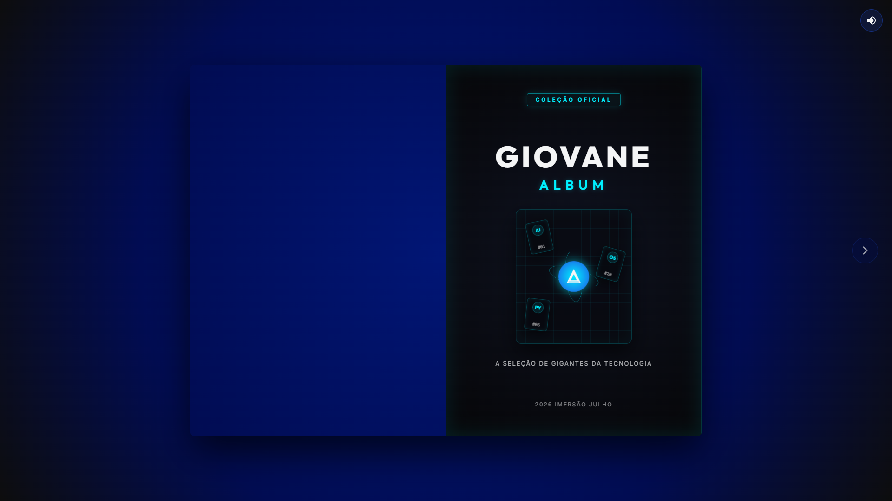

# 🏆 Álbum de Figurinhas Tech — Copa do Mundo Tech

<p align="center">
  
  
  
  
  
</p>

Uma aplicação web moderna e interativa que simula um **Álbum de Figurinhas Virtual** celebrando os maiores nomes e pioneiros da tecnologia. O projeto conta com uma API robusta desenvolvida em **FastAPI (Python)** no backend e uma interface rica e fluida com efeito 3D realista de virada de página no frontend.

---

## 📷 Screenshots e Demonstração

| Capa do Álbum | Páginas Internas |
| :---: | :---: |
|  |  |

---

## 🛠️ Stack Tecnológica

O projeto foi construído utilizando as seguintes tecnologias e bibliotecas:

*   **Backend:**
    *   **Python 3.10+** - Linguagem base do servidor.
    *   **FastAPI** - Framework moderno de alto desempenho para construção de APIs.
    *   **Uvicorn** - Servidor ASGI rápido para rodar a aplicação FastAPI.
    *   **CORS Middleware** - Integração segura entre o backend e frontend rodando em origens distintas.
*   **Frontend:**
    *   **HTML5 & CSS3** - Estruturação e estilização moderna (incluindo efeitos de glow, glitch e design responsivo premium).
    *   **JavaScript (ES6+)** - Lógica de consumo de API e controle do ciclo de vida da interface.
    *   **St.PageFlip** - Biblioteca JavaScript para simular efeitos realistas de virada de páginas de livros físicos.

---

## 🚀 Principais Funcionalidades

*   **📖 Álbum Interativo 3D:** Experiência imersiva de folhear um álbum físico de figurinhas no seu navegador.
*   **🔌 Integração Dinâmica via API:** Carregamento de figurinhas em tempo real diretamente do backend.
*   **🖼️ Servidor de Mídias Sob Demanda:** O backend localiza e serve as fotos das lendas da tecnologia de forma dinâmica.
*   **🎵 Feedback Sonoro e Controle de Áudio:** Efeito sonoro realista ao passar as páginas, com controle de mudo ativável.
*   **⚡ Design Glitch e Premium:** Estética moderna inspirada na cultura hacker, cyberpunk e tecnologia de ponta.
*   **🌐 Organização por Categorias:** Figurinhas distribuídas por temas (IA, Python, Banco de Dados, Sistemas Operacionais, Lendas da Computação e Brasileiros de Destaque).

---

## 📁 Estrutura do Projeto

```text
código/
├── backend/
│   ├── figurinhas/          # Banco de imagens das figurinhas (.png, .jpg)
│   ├── main.py              # Servidor API FastAPI
│   └── venv/                # Ambiente virtual Python
├── frontend/
│   ├── index.html           # Layout do Álbum de Figurinhas
│   ├── style.css            # Estilização visual premium e animações
│   └── app.js               # Integração com API e controle do PageFlip
└── README.md                # Documentação do projeto
```

---

## 🔧 Instalação e Execução Local

Siga os passos abaixo para rodar o projeto em sua máquina:

### 1. Configurando o Backend

1.  Navegue até o diretório do backend:
    ```bash
    cd backend
    ```
2.  Crie um ambiente virtual do Python:
    ```bash
    python -m venv venv
    ```
3.  Ative o ambiente virtual:
    *   **Windows (PowerShell):**
        ```powershell
        .\venv\Scripts\Activate.ps1
        ```
    *   **Windows (CMD):**
        ```cmd
        .\venv\Scripts\activate.bat
        ```
    *   **Linux/macOS:**
        ```bash
        source venv/bin/activate
        ```
4.  Instale as dependências necessárias:
    ```bash
    pip install fastapi uvicorn
    ```
5.  Inicie o servidor de desenvolvimento:
    ```bash
    uvicorn main:app --reload
    ```
    *O backend estará rodando em `http://localhost:8000`.*

### 2. Configurando o Frontend

Como o frontend é composto por arquivos estáticos (`HTML`/`CSS`/`JS`), você pode executá-lo de duas formas principais:

*   **Opção A (Recomendada - VSCode):** Instale a extensão **Live Server** no VSCode, abra o arquivo `frontend/index.html` e clique em **Go Live**.
*   **Opção B (Servidor Python):** Na raiz do diretório `frontend`, rode o comando:
    ```bash
    python -m http.server 3000
    ```
    E acesse `http://localhost:3000` no seu navegador.

---

## 💻 Como Utilizar e Interagir

### Exemplo de Resposta da API
Ao rodar a API, você pode acessar a documentação interativa Swagger em `http://localhost:8000/docs`.

Para obter a lista de figurinhas cadastradas, você pode realizar uma requisição `GET` para o endpoint `/figurinhas`.

#### Exemplo de requisição com `curl`:
```bash
curl http://localhost:8000/figurinhas
```

#### Retorno JSON esperado:
```json
[
  {
    "id": 1,
    "nome": "Alan Turing",
    "categoria": "IA",
    "imagem_url": "/figurinhas/1/imagem"
  },
  {
    "id": 2,
    "nome": "John McCarthy",
    "categoria": "IA",
    "imagem_url": "/figurinhas/2/imagem"
  }
]
```

---

## 🤝 Contribuição

Contribuições são super bem-vindas! Siga os passos abaixo para colaborar:

1.  Faça um **Fork** do projeto.
2.  Crie uma nova branch com sua funcionalidade: `git checkout -b feature/minha-feature`.
3.  Salve suas alterações e faça o commit: `git commit -m 'Adiciona nova figurinha'`.
4.  Envie para a branch original: `git push origin feature/minha-feature`.
5.  Abra um **Pull Request**.

---

## ✉️ Contato

Desenvolvido por **Giovane Vicente** durante a Imersão Alura.

*   **GitHub:** [Descubra outros projetos!](https://github.com/giponvi)
*   **LinkedIn:** [Vamos conectar!](https://www.linkedin.com/in/giovane-vicente)
*   **E-mail:** [Entre em contato!](mailto:giponvi@gmail.com)
